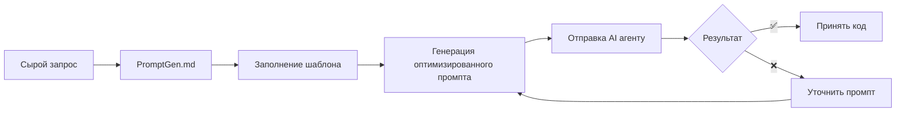

# PromptGen — Мета-промпт для оптимизации запросов к AI агентам

## 🎯 Назначение

Этот мета-промпт преобразует ваши сырые запросы в структурированные, оптимизированные промпты для AI агентов по разработке ПО. Используйте его для получения кода production-качества за один проход.

---

## 📋 Как использовать

### Вариант 1: Прямое использование
Скопируйте этот файл и заполните секцию **[ВАШ ЗАПРОС]** своими требованиями. Отправьте AI агенту.

### Вариант 2: Через генерацию
Отправьте этот мета-промпт AI с вашим сырым запросом и попросите:
> "Сгенерируй оптимизированный промпт на основе PromptGen.md для следующей задачи: [ваш запрос]"

---

## 🏗️ Шаблон оптимизированного промпта

```markdown
# [НАЗВАНИЕ ЗАДАЧИ/ФУНКЦИОНАЛА]

## 🎯 Контекст и цель
*Краткое описание: какую проблему решаем? почему это важно? какой ожидаемый результат?*

## 👤 Роль и поведение AI агента

### Роль (опционально для творческих задач)
*Пример: "Ты senior backend разработчик с экспертизой в [технологии]"*
*⚠️ Примечание: для задач на точность (код, факты) простая роль не улучшает результат. 
Фокусируйся на конкретных требованиях, а не на персоне.*

### Критическое поведение
- **НЕ фантазируй и НЕ выдумывай** факты, библиотеки, API, имена файлов
- **Если информации недостаточно — ЗАДАЙ уточняющие вопросы** перед реализацией
- **Если не уверен — явно укажи на неопределённость** и предложи варианты проверки
- **НЕ оставляй TODO заглушек** — реализуй полностью или явно запроси недостающие данные
- **Цитируй источники** если используешь внешние знания (документация, RFC, specs)

### Режим работы
- [ ] **Автономный** — действуй самостоятельно, задавай вопросы только при критической нехватке данных
- [ ] **Консультативный** — предлагай план, получай подтверждение перед реализацией
- [ ] **Строгий** — задавай вопросы по каждому неочевидному решению

## ✅ Критерии приёмки (Definition of Done)
- [ ] Требование 1 (измеримое)
- [ ] Требование 2 (измеримое)
- [ ] Требование 3 (измеримое)
- [ ] Тесты написаны и проходят
- [ ] Код соответствует стандартам проекта

## 📁 Контекст проекта

### Структура проекта
```
project/
├── src/
├── tests/
├── docs/
└── ...
```

### Существующие файлы для контекста
- `path/to/file1.ts` — описание назначения
- `path/to/file2.py` — описание назначения

### Правила проекта (.cursor/rules или аналог)
- [rules/coding-standards.md](rules/coding-standards.md)
- [rules/architecture.md](rules/architecture.md)

## 🏛️ Архитектурные требования

### Принципы проектирования
- [ ] **KISS (Keep It Simple, Stupid)** — выбирай максимально простое решение, работающее для задачи
- [ ] **YAGNI (You Ain't Gonna Need It)** — не добавляй функциональность «на будущее»
- [ ] **DRY (Don't Repeat Yourself)** — избегай дублирования кода
- [ ] **Separation of Concerns** — разделение на слои (данные / логика / UI)
- [ ] **Модульность** — независимые компоненты с чёткими интерфейсами

### Простота vs Переоптимизация
- ❌ **НЕ создавай** абстракции «на будущее»
- ❌ **НЕ используй** сложные паттерны без необходимости
- ❌ **НЕ добавляй** зависимости без острой нужды
- ✅ **ВЫБИРАЙ** стандартные решения вместо экзотических
- ✅ **ПРЕДПОЧИТАЙ** встроенные возможности языка/фреймворка

### Доменная модель (псевдокод/TypeScript)
```typescript
// Core domain entities и их взаимосвязи
interface Entity {
  id: string;
  // ...
}
```

### Паттерны и принципы
- [ ] SOLID
- [ ] DDD (если применимо)
- [ ] Clean Architecture
- [ ] Другие: _____

### Технологический стек
- Язык: _____
- Фреймворк: _____
- База данных: _____
- Другие зависимости: _____

## 📝 Требования к реализации

### Декомпозиция на этапы

*Разбей задачу на логические, небольшие этапы. Для каждого этапа укажи:*

```markdown
## Этап 1: [Название]
- **Цель:** [что достигается]
- **Файлы:** [какие файлы создаются/изменяются]
- **Критерий завершения:** [как поймём что готово]

## Этап 2: [Название]
...
```

### Принципы декомпозиции
- ✅ **Последовательность** — этапы выполняются по порядку, каждый следующий опирается на предыдущий
- ✅ **Независимость** — каждый этап можно протестировать отдельно
- ✅ **Измеримость** — явный критерий завершения этапа
- ✅ **Демонстрируемость** — после каждого этапа есть что показать пользователю

### Функциональные требования
1. [Описание функции 1]
2. [Описание функции 2]
3. [Описание функции 3]

### Нефункциональные требования
- **Производительность:** _____
- **Безопасность:** _____
- **Масштабируемость:** _____
- **Наблюдаемость (logging/metrics/tracing):** _____

### API спецификация (если применимо)
```yaml
# OpenAPI / REST / GraphQL схема
# Или примеры request/response
```

## 🔌 Расширяемость и поддержка

### Точки расширения
*Предусмотри возможности для будущего расширения:*
- [ ] **Плагин-архитектура** — где можно подключить дополнительные модули
- [ ] **Конфигурируемость** — что выносится в конфиги/переменные окружения
- [ ] **Хуки и события** — точки для внедрения кастомной логики
- [ ] **Интерфейсы для наследования** — классы/методы для override

### Принципы расширяемости
- ✅ **Модульность** — независимые компоненты
- ✅ **Чёткие контракты** — стабильные API между модулями
- ✅ **Обратная совместимость** — не ломать существующие интеграции
- ✅ **Документированные точки расширения** — явные инструкции для разработчиков

### Лёгкий деплой
*Обеспечь простоту развёртывания:*
- [ ] **Dockerfile** — контейнеризация
- [ ] **docker-compose.yml** — локальный запуск зависимостей
- [ ] **Миграции БД** — автоматическое применение
- [ ] **Environment variables** — конфигурация через переменные окружения
- [ ] **Health checks** — эндпоинты для проверки состояния
- [ ] **README с инструкцией** — `npm install && npm run dev`

### Поддержка и наблюдаемость
- [ ] **Логирование** — структурированные логи с уровнями
- [ ] **Метрики** — ключевые показатели производительности
- [ ] **Трассировка** — для отладки распределённых вызовов
- [ ] **Документация** — API docs, архитектурные решения (ADR)

## 🧪 Стратегия тестирования

### Типы тестов
- [ ] Unit тесты (покрытие: ___%)
- [ ] Integration тесты
- [ ] E2E тесты
- [ ] Contract тесты

### Test cases (ключевые сценарии)
1. Happy path: _____
2. Edge case 1: _____
3. Edge case 2: _____
4. Error handling: _____

### Примеры тестов (specification by example)
```typescript
// Пример ожидаемого теста
describe('Feature', () => {
  it('should ...', async () => {
    // ...
  });
});
```

## 🔒 Безопасность и валидация

### Чек-лист безопасности
- [ ] Входные данные валидированы
- [ ] Нет SQL injection рисков
- [ ] Нет XSS уязвимостей
- [ ] Авторизация проверена
- [ ] Секреты не захардкожены
- [ ] Rate limiting (если API)

### Ограничения и запреты
- ❌ НЕ использовать [библиотеку/паттерн]
- ❌ НЕ создавать [тип файла/архитектуру]
- ❌ НЕ реализовывать [функционал]

## 📊 Примеры использования

### Пример 1: Basic usage
```typescript
// Входные данные
// Ожидаемый результат
```

### Пример 2: Edge case
```typescript
// Входные данные
// Ожидаемый результат
```

## 🔍 Self-verification чек-лист для AI

Перед завершением проверь:
- [ ] Все критерии приёмки выполнены
- [ ] Код компилируется без ошибок
- [ ] Тесты проходят
- [ ] Нет TODO заглушек
- [ ] Логирование добавлено
- [ ] Обработка ошибок реализована
- [ ] Код следует стандартам проекта
- [ ] Нет дублирования (DRY)
- [ ] Имена понятные (clean code)
- [ ] **НЕ выдуманы факты/библиотеки/API**
- [ ] **Заданы уточняющие вопросы** если были неясности
- [ ] **Неопределённости явно указаны** если есть

## 🧠 Chain-of-Thought для сложных задач

*Для комплексных задач используй пошаговое рассуждение:*

```markdown
### План решения
1. [Шаг 1 — анализ/исследование]
2. [Шаг 2 — проектирование]
3. [Шаг 3 — реализация]
4. [Шаг 4 — тестирование]

### Рассуждения
[Объясни логику каждого шага, альтернативы и почему выбран этот путь]

### Реализация
[Код]
```

## 📦 Ожидаемый результат

### Формат вывода
- [ ] Полный код файлов с путями
- [ ] Миграции БД (если нужно)
- [ ] Тесты
- [ ] Обновлённая документация
- [ ] Инструкция по запуску

### Файлы для AI агентов

*Создай структуру файлов контекста для эффективной работы AI:*

```
project/
├── AGENTS.md                    # Корневой файл: описание проекта и навигация
└── agent_instructions/          # Директория с инструкциями для агентов
    ├── 00-common.md             # Общие правила для всех агентов
    ├── 01-architecture.md       # Архитектурные принципы и паттерны
    ├── 02-coding-standards.md   # Стандарты кода и конвенции
    ├── 03-testing.md            # Стратегия тестирования
    └── 04-security.md           # Security guidelines
```

### AGENTS.md (корневой файл)

*Краткий файл в корне проекта для всех AI агентов:*

```markdown
# Project Name

## Описание
[1-2 предложения о проекте]

## Технологический стек
- Язык: ___
- Фреймворк: ___
- База данных: ___

## Структура проекта
[Дерево файлов с краткими комментариями]

## Команды
- `npm run dev` — запуск разработки
- `npm run build` — сборка
- `npm run test` — тесты
- `npm run lint` — линтинг

## Инструкции для AI агентов
См. [`agent_instructions/`](agent_instructions/)
```

### agent_instructions/00-common.md (общие правила)

*Базовые принципы для всех задач:*

```markdown
# Общие правила

## Поведение
- НЕ фантазируй факты, библиотеки, API
- Если информации недостаточно — ЗАДАЙ вопросы
- Выбери простое решение вместо сложного (KISS)
- НЕ добавляй функциональность «на будущее» (YAGNI)

## Рабочий процесс
1. Изучи контекст в AGENTS.md
2. Прочти релевантные инструкции из agent_instructions/
3. Разбей задачу на этапы
4. Реализуй и протестируй каждый этап
5. Запроси подтверждение перед следующим этапом
```

### agent_instructions/01-architecture.md

```markdown
# Архитектурные принципы

## Паттерны
- [Паттерны проекта]

## Структура
- [Организация кода]

## Доменная модель
[Основные сущности и взаимосвязи]
```

### agent_instructions/02-coding-standards.md

```markdown
# Стандарты кода

## Именование
- [Конвенции именования]

## Стиль
- [Отступы, кавычки, форматирование]

## Паттерны
- [Предпочитаемые паттерны]
- [Анти-паттерны]
```

### agent_instructions/03-testing.md

```markdown
# Тестирование

## Типы тестов
- Unit: ___
- Integration: ___
- E2E: ___

## Запуск
- `npm run test` — все тесты
- `npm run test:watch` — watch режим

## Требования
- Покрытие: ___%
- [Дополнительные требования]
```

### agent_instructions/04-security.md

```markdown
# Безопасность

## Обязательные проверки
- [ ] Входные данные валидированы
- [ ] Нет SQL injection
- [ ] Нет XSS уязвимостей
- [ ] Авторизация проверена

## Запрещено
- Хардкод секретов
- [Другие запреты]
```

### Принципы файлов для агентов
- ✅ **Модульность** — отдельные файлы для каждой темы
- ✅ **Нумерация** — префиксы 00-, 01-, 02- для порядка
- ✅ **Краткость** — только существенная информация
- ✅ **Ссылки** — ссылайся на файлы, не копируй содержимое
- ✅ **Живой документ** — обновляй при систематических ошибках

### Файлы для пользователей

*Создай документацию для разработчиков и заказчиков:*

```
project/
├── README.md                    # Основная документация
├── QUICKSTART.md                # Быстрый старт (< 10 минут)
├── ROADMAP.md                   # План развития проекта
└── docs/
    ├── WORKFLOW.md              # Рабочие процессы и CI/CD
    ├── CHECKLIST.md             # Чек-листы для релиза/деплоя
    ├── ARCHITECTURE.md          # Архитектурные решения (ADR)
    ├── API.md                   # API документация
    ├── DEPLOYMENT.md            # Инструкции по развёртыванию
    └── CHANGELOG.md             # Журнал изменений
```

### README.md (основная документация)

```markdown
# Project Name

## Описание
[Что делает проект, для кого, ценность]

## Возможности
- [Feature 1]
- [Feature 2]

## Быстрый старт
1. `git clone <url>`
2. `npm install`
3. `cp .env.example .env`
4. `npm run dev`

## Структура репозитория
[Дерево с комментариями]

## Документация
- [QUICKSTART.md](QUICKSTART.md) — быстрый запуск
- [ROADMAP.md](ROADMAP.md) — план развития
- [docs/](docs/) — дополнительная документация
```

### QUICKSTART.md (быстрый старт)

```markdown
# Быстрый старт

## Prerequisites
- Node.js >= 20
- [Другие зависимости]

## Установка
1. `git clone <url>`
2. `npm install`
3. Настройка `.env` (см. .env.example)
4. `npm run dev`

## Проверка
- Открыть http://localhost:3000
- `curl http://localhost:3000/api/health`
```

### ROADMAP.md (план развития)

```markdown
# Roadmap

## Этап 1: MVP (Q1 2026)
- [ ] Feature 1
- [ ] Feature 2

## Этап 2: Production (Q2 2026)
- [ ] Feature 3
- [ ] Feature 4

## Будущее
- [ ] Feature 5
- [ ] Feature 6
```

### docs/WORKFLOW.md (рабочие процессы)

```markdown
# Рабочие процессы

## Разработка
1. Создать ветку `feature/xxx`
2. Реализовать
3. Запустить тесты
4. Создать PR

## CI/CD
- GitHub Actions: [ссылка]
- Deploy: автоматически после мержа

## Релиз
1. Обновить версию в package.json
2. Обновить CHANGELOG.md
3. Создать git tag
```

### docs/CHECKLIST.md (чек-листы)

```markdown
# Чек-листы

## Пре-коммит
- [ ] Код отформатирован
- [ ] Тесты проходят
- [ ] Линтер чист

## Пре-релиз
- [ ] Все тесты проходят
- [ ] CHANGELOG обновлён
- [ ] Версия обновлена
- [ ] Документация актуальна

## Деплой
- [ ] Бэкап БД
- [ ] Миграции применены
- [ ] Health check проходит
```

### Принципы файлов для пользователей
- ✅ **Quick Start < 10 минут** — новый пользователь запускает быстро
- ✅ **Наглядность** — скриншоты, диаграммы, примеры
- ✅ **Простота** — язык бизнеса, не только технический
- ✅ **Полнота** — все переменные, команды, зависимости
- ✅ **Тестируемость** — протестируй инструкцию на чистом окружении

### Пошаговая реализация с демонстрацией

*После каждого этапа делай паузу для демонстрации:*

```markdown
## 🎯 Демонстрация Этапа 1

### Что готово
- [Список реализованного]

### Как проверить
```bash
# Команды для запуска/тестирования
npm run dev
curl http://localhost:3000/api/...
```

### Скриншоты/примеры ответа
[Что пользователь увидит]

### Запрос подтверждения
> ✅ Этап 1 завершён. Готов переходить к Этапу 2 или нужны правки?
```

### Для заказчика/стейкхолдера
*Подготовь материалы для демонстрации:*
- [ ] **Краткое описание** — что сделано, на каком языке бизнеса
- [ ] **Визуализация** — скриншоты, диаграммы, видео
- [ ] **Метрики успеха** — как измерить ценность
- [ ] **Следующие шаги** — что будет дальше
- [ ] **Вопросы для обратной связи** — что нужно уточнить

### Структура ответа
```
## Изменения
### Файл 1: path/to/file.ts
\`\`\`typescript
// код
\`\`\`

### Файл 2: path/to/file2.ts
...

## Тесты
[Описание как запустить]

## Миграции
[SQL или инструкции]

## Заметки
[Важные детали, ограничения, будущие улучшения]
```

---

## ⚠️ Анти-паттерны (избегать)

| Ошибка | Последствие | Решение |
|--------|-------------|---------|
| Расплывчатые цели («улучши», «оптимизируй») | Непредсказуемый результат | Конкретные измеримые требования |
| Слишком много задач в одном промпте | Частичное выполнение | Декомпозиция на подзадачи |
| Неявные ограничения | Дрейф поведения | Явные правила и запреты |
| Перегрузка контекста | Модель теряет важное | Just-in-time контекст |
| Отсутствие примеров | Неправильная интерпретация | Specification by example |
| Нет критериев успеха | Невозможно проверить результат | Definition of Done чек-лист |
| **Простая роль без деталей** | **Не улучшает точность** | **Конкретные требования > персона** |
| **Модель фантазирует** | **Неверный код/факты** | **Запрет выдумок + вопросы** |
| **Переоптимизация/абстракции «на будущее»** | **Усложнение, технический долг** | **KISS, YAGNI** |
| **Отсутствие декомпозиции** | **Незавершённые большие задачи** | **Разбиение на этапы с демонстрацией** |
| **Сложный деплой** | **Проблемы с production** | **Docker, env vars, health checks** |
| **Нет точек расширения** | **Невозможность развивать** | **Модульность, хуки, контракты** |

---

## 🎛️ Настройки для разных сценариев

### Для новой фичи
- Акцент на: доменную модель, API spec, тесты
- Требовать: полную реализацию с миграциями
- Документация: обновить README, AGENTS.md

### Для рефакторинга
- Акцент на: сохранение поведения, покрытие тестами
- Требовать: diff с объяснением изменений
- Документация: обновить ARCHITECTURE.md, CHANGELOG.md

### Для багфикса
- Акцент на: воспроизведение, root cause analysis
- Требовать: тест на регрессию
- Документация: зафиксировать в BUGS.md или CHANGELOG.md

### Для документации
- Акцент на: полноту, примеры использования
- Требовать: структуру, searchability
- Документация: README, QUICKSTART.md, API docs

### 5 основных документов AI-проекта (Minimum Viable Documentation)

| Приоритет | Документ | Назначение |
|-----------|----------|------------|
| 🔴 | **PRD.md** | Требования продукта, функции, критерии приёмки |
| 🔴 | **AGENTS.md** + `agent_instructions/` | Контекст для AI: стек, команды, конвенции |
| 🟡 | **ARCHITECTURE.md** | Технические решения, схема БД, API |
| 🟡 | **TESTING.md** | Стратегия тестирования, CI/CD |
| 🟢 | **ROADMAP.md** | План развития, приоритеты, статус |

> 2 часа документации экономят 20+ часов на исправление AI-кода

---

## [ВАШ ЗАПРОС]

*Заполните эту секцию вашим сырым запросом. Будьте максимально подробны:*

### Описание задачи
[Что нужно сделать?]

### Текущее состояние
[Что уже есть? Какие файлы/код?]

### Проблемы/боли
[Что не работает? Что нужно улучшить?]

### Ограничения
[Технологии, время, зависимости?]

### Примеры/референсы
[Ссылки, скриншоты, похожий код?]

### Дополнительный контекст
[Всё, что поможет AI понять задачу]
```

---

## 🔄 Рабочий процесс с PromptGen



---

## 💡 Советы по использованию

1. **Начинайте с нового чата** — без prior context для чистоты выполнения
2. **Будьте конкретны в критериях** — измеримые требования = лучший результат
3. **Добавляйте примеры** — specification by example работает лучше описаний
4. **Используйте self-verification** — заставьте AI проверить себя перед выдачей
5. **Итеративно улучшайте** — сохраняйте успешные промпты как шаблоны

---

## 📚 Источники и лучшие практики

- [Cursor: Best practices for coding with agents](https://cursor.com/blog/agent-best-practices)
- [Equal Experts: Meta-prompting in AI coding](https://www.equalexperts.com/blog/ai/from-madness-to-method-with-ai-coding-part-1-meta-prompting/)
- [ARTJOKER: AI Prompt Engineering Best Practices 2026](https://artjoker.net/blog/ai-prompt-engineering-best-practices/)
- [Voiceflow: 5 Proven Strategies to Prevent LLM Hallucinations](https://www.voiceflow.com/blog/prevent-llm-hallucinations)
- [Anthropic: Effective context engineering for AI agents](https://www.anthropic.com/engineering/effective-context-engineering-for-ai-agents)
- [Zuci Systems: 7 Guiding Principles for AI Agent Design](https://www.zucisystems.com/blogs/design-ai-agents-principles)
- [Emergent Mind: Task Decomposition Strategies](https://www.emergentmind.com/topics/task-decomposition-strategies)
- [Strapi: Extensibility in Software Engineering](https://strapi.io/blog/extensibility-in-software-engineering)
- [Vibeworkflow: 5 Documents Every AI Coding Project Needs](https://vibeworkflow.app/blog/ai-coding-documentation)
- [EclipseSource: Mastering Project Context Files](https://eclipsesource.com/blogs/2025/11/20/mastering-project-context-files-for-ai-coding-agents/)
- [FreeCodeCamp: How to Structure Your README File](https://www.freecodecamp.org/news/how-to-structure-your-readme-file/)
- Фреймворки: C.O.S.T., R.A.G.E., PromptWizard, Chain-of-Thought, KISS, YAGNI

---

*Версия: 1.4 | Последнее обновление: Март 2026*

### Изменения в версии 1.4
- ✅ Убраны привязки к конкретным агентам (Claude, Cursor)
- ✅ AGENTS.md в корне — единый файл для всех AI агентов
- ✅ agent_instructions/ — директория с модульными инструкциями
- ✅ Нумерация файлов: 00-common, 01-architecture, 02-coding...
- ✅ ROADMAP.md — план развития проекта
- ✅ docs/WORKFLOW.md — рабочие процессы и CI/CD
- ✅ docs/CHECKLIST.md — чек-листы пре-коммит/пре-релиз/деплой
- ✅ Разделение по логическому смыслу, не по инструментам

### Изменения в версии 1.3
- ✅ Файлы для AI агентов: AGENTS.md, agent_instructions/
- ✅ Файлы для пользователей: README.md, QUICKSTART.md, docs/*
- ✅ Принципы документации: краткость для агентов, наглядность для людей
- ✅ 5 основных документов AI-проекта (Minimum Viable Documentation)

### Изменения в версии 1.2
- ✅ Добавлены принципы KISS, YAGNI для простых решений
- ✅ Декомпозиция на логические небольшие этапы
- ✅ Расширяемость: точки расширения, модульность, хуки, контракты
- ✅ Лёгкий деплой: Docker, env vars, health checks, миграции
- ✅ Пошаговая реализация с демонстрацией пользователю/заказчику
- ✅ Материалы для стейкхолдеров: метрики успеха, визуализация, обратная связь
- ✅ Обновлены анти-паттерны

### Изменения в версии 1.1
- ✅ Добавлена секция про роль и поведение AI агента
- ✅ Добавлены инструкции: НЕ фантазировать, задавать вопросы при неясностях
- ✅ Добавлен режим работы (автономный/консультативный/строгий)
- ✅ Расширен self-verification чек-лист
- ✅ Добавлен Chain-of-Thought для сложных задач
- ✅ Обновлены анти-паттерны и источники
