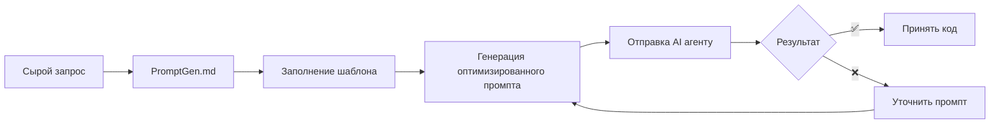

# PromptGen — Мета-промпт для оптимизации запросов к AI агентам

## 🎯 Назначение

Этот мета-промпт преобразует ваши сырые запросы в структурированные, оптимизированные промпты для AI агентов по разработке ПО. Используйте его для получения кода production-качества за один проход.

---

## 📋 Как использовать

### Вариант 1: Прямое использование
Скопируйте этот файл и заполните секцию **[ВАШ ЗАПРОС]** своими требованиями. Отправьте AI агенту.

### Вариант 2: Через генерацию
Отправьте этот мета-промпт AI с вашим сырым запросом и попросите:
> "Сгенерируй оптимизированный промпт на основе PromptGen.md для следующей задачи: [ваш запрос]"

---

## 🏗️ Шаблон оптимизированного промпта

```markdown
# [НАЗВАНИЕ ЗАДАЧИ/ФУНКЦИОНАЛА]

## 🎯 Контекст и цель
*Краткое описание: какую проблему решаем? почему это важно? какой ожидаемый результат?*

## 👤 Роль и поведение AI агента

### Роль (опционально для творческих задач)
*Пример: "Ты senior backend разработчик с экспертизой в [технологии]"*
*⚠️ Примечание: для задач на точность (код, факты) простая роль не улучшает результат. 
Фокусируйся на конкретных требованиях, а не на персоне.*

### Критическое поведение
- **НЕ фантазируй и НЕ выдумывай** факты, библиотеки, API, имена файлов
- **Если информации недостаточно — ЗАДАЙ уточняющие вопросы** перед реализацией
- **Если не уверен — явно укажи на неопределённость** и предложи варианты проверки
- **НЕ оставляй TODO заглушек** — реализуй полностью или явно запроси недостающие данные
- **Цитируй источники** если используешь внешние знания (документация, RFC, specs)

### Режим работы
- [ ] **Автономный** — действуй самостоятельно, задавай вопросы только при критической нехватке данных
- [ ] **Консультативный** — предлагай план, получай подтверждение перед реализацией
- [ ] **Строгий** — задавай вопросы по каждому неочевидному решению

## ✅ Критерии приёмки (Definition of Done)
- [ ] Требование 1 (измеримое)
- [ ] Требование 2 (измеримое)
- [ ] Требование 3 (измеримое)
- [ ] Тесты написаны и проходят
- [ ] Код соответствует стандартам проекта

## 📁 Контекст проекта

### Структура проекта
```
project/
├── src/
├── tests/
├── docs/
└── ...
```

### Существующие файлы для контекста
- `path/to/file1.ts` — описание назначения
- `path/to/file2.py` — описание назначения

### Правила проекта (.cursor/rules или аналог)
- [rules/coding-standards.md](rules/coding-standards.md)
- [rules/architecture.md](rules/architecture.md)

## 🏛️ Архитектурные требования

### Доменная модель (псевдокод/TypeScript)
```typescript
// Core domain entities и их взаимосвязи
interface Entity {
  id: string;
  // ...
}
```

### Паттерны и принципы
- [ ] SOLID
- [ ] DDD (если применимо)
- [ ] Clean Architecture
- [ ] Другие: _____

### Технологический стек
- Язык: _____
- Фреймворк: _____
- База данных: _____
- Другие зависимости: _____

## 📝 Требования к реализации

### Функциональные требования
1. [Описание функции 1]
2. [Описание функции 2]
3. [Описание функции 3]

### Нефункциональные требования
- **Производительность:** _____
- **Безопасность:** _____
- **Масштабируемость:** _____
- **Наблюдаемость (logging/metrics/tracing):** _____

### API спецификация (если применимо)
```yaml
# OpenAPI / REST / GraphQL схема
# Или примеры request/response
```

## 🧪 Стратегия тестирования

### Типы тестов
- [ ] Unit тесты (покрытие: ___%)
- [ ] Integration тесты
- [ ] E2E тесты
- [ ] Contract тесты

### Test cases (ключевые сценарии)
1. Happy path: _____
2. Edge case 1: _____
3. Edge case 2: _____
4. Error handling: _____

### Примеры тестов (specification by example)
```typescript
// Пример ожидаемого теста
describe('Feature', () => {
  it('should ...', async () => {
    // ...
  });
});
```

## 🔒 Безопасность и валидация

### Чек-лист безопасности
- [ ] Входные данные валидированы
- [ ] Нет SQL injection рисков
- [ ] Нет XSS уязвимостей
- [ ] Авторизация проверена
- [ ] Секреты не захардкожены
- [ ] Rate limiting (если API)

### Ограничения и запреты
- ❌ НЕ использовать [библиотеку/паттерн]
- ❌ НЕ создавать [тип файла/архитектуру]
- ❌ НЕ реализовывать [функционал]

## 📊 Примеры использования

### Пример 1: Basic usage
```typescript
// Входные данные
// Ожидаемый результат
```

### Пример 2: Edge case
```typescript
// Входные данные
// Ожидаемый результат
```

## 🔍 Self-verification чек-лист для AI

Перед завершением проверь:
- [ ] Все критерии приёмки выполнены
- [ ] Код компилируется без ошибок
- [ ] Тесты проходят
- [ ] Нет TODO заглушек
- [ ] Логирование добавлено
- [ ] Обработка ошибок реализована
- [ ] Код следует стандартам проекта
- [ ] Нет дублирования (DRY)
- [ ] Имена понятные (clean code)
- [ ] **НЕ выдуманы факты/библиотеки/API**
- [ ] **Заданы уточняющие вопросы** если были неясности
- [ ] **Неопределённости явно указаны** если есть

## 🧠 Chain-of-Thought для сложных задач

*Для комплексных задач используй пошаговое рассуждение:*

```markdown
### План решения
1. [Шаг 1 — анализ/исследование]
2. [Шаг 2 — проектирование]
3. [Шаг 3 — реализация]
4. [Шаг 4 — тестирование]

### Рассуждения
[Объясни логику каждого шага, альтернативы и почему выбран этот путь]

### Реализация
[Код]
```

## 📦 Ожидаемый результат

### Формат вывода
- [ ] Полный код файлов с путями
- [ ] Миграции БД (если нужно)
- [ ] Тесты
- [ ] Обновлённая документация
- [ ] Инструкция по запуску

### Структура ответа
```
## Изменения
### Файл 1: path/to/file.ts
\`\`\`typescript
// код
\`\`\`

### Файл 2: path/to/file2.ts
...

## Тесты
[Описание как запустить]

## Миграции
[SQL или инструкции]

## Заметки
[Важные детали, ограничения, будущие улучшения]
```

---

## ⚠️ Анти-паттерны (избегать)

| Ошибка | Последствие | Решение |
|--------|-------------|---------|
| Расплывчатые цели («улучши», «оптимизируй») | Непредсказуемый результат | Конкретные измеримые требования |
| Слишком много задач в одном промпте | Частичное выполнение | Декомпозиция на подзадачи |
| Неявные ограничения | Дрейф поведения | Явные правила и запреты |
| Перегрузка контекста | Модель теряет важное | Just-in-time контекст |
| Отсутствие примеров | Неправильная интерпретация | Specification by example |
| Нет критериев успеха | Невозможно проверить результат | Definition of Done чек-лист |
| **Простая роль без деталей** | **Не улучшает точность** | **Конкретные требования > персона** |
| **Модель фантазирует** | **Неверный код/факты** | **Запрет выдумок + вопросы** |

---

## 🎛️ Настройки для разных сценариев

### Для новой фичи
- Акцент на: доменную модель, API spec, тесты
- Требовать: полную реализацию с миграциями

### Для рефакторинга
- Акцент на: сохранение поведения, покрытие тестами
- Требовать: diff с объяснением изменений

### Для багфикса
- Акцент на: воспроизведение, root cause analysis
- Требовать: тест на регрессию

### Для документации
- Акцент на: полноту, примеры использования
- Требовать: структуру, searchability

---

## [ВАШ ЗАПРОС]

*Заполните эту секцию вашим сырым запросом. Будьте максимально подробны:*

### Описание задачи
[Что нужно сделать?]

### Текущее состояние
[Что уже есть? Какие файлы/код?]

### Проблемы/боли
[Что не работает? Что нужно улучшить?]

### Ограничения
[Технологии, время, зависимости?]

### Примеры/референсы
[Ссылки, скриншоты, похожий код?]

### Дополнительный контекст
[Всё, что поможет AI понять задачу]
```

---

## 🔄 Рабочий процесс с PromptGen



---

## 💡 Советы по использованию

1. **Начинайте с нового чата** — без prior context для чистоты выполнения
2. **Будьте конкретны в критериях** — измеримые требования = лучший результат
3. **Добавляйте примеры** — specification by example работает лучше описаний
4. **Используйте self-verification** — заставьте AI проверить себя перед выдачей
5. **Итеративно улучшайте** — сохраняйте успешные промпты как шаблоны

---

## 📚 Источники и лучшие практики

- [Cursor: Best practices for coding with agents](https://cursor.com/blog/agent-best-practices)
- [Equal Experts: Meta-prompting in AI coding](https://www.equalexperts.com/blog/ai/from-madness-to-method-with-ai-coding-part-1-meta-prompting/)
- [ARTJOKER: AI Prompt Engineering Best Practices 2026](https://artjoker.net/blog/ai-prompt-engineering-best-practices/)
- [Voiceflow: 5 Proven Strategies to Prevent LLM Hallucinations](https://www.voiceflow.com/blog/prevent-llm-hallucinations)
- [Learn Prompting: Role Prompting Guide](https://learnprompting.org/docs/advanced/zero_shot/role_prompting)
- [Anthropic: Effective context engineering for AI agents](https://www.anthropic.com/engineering/effective-context-engineering-for-ai-agents)
- Фреймворки: C.O.S.T., R.A.G.E., PromptWizard, Chain-of-Thought

---

*Версия: 1.1 | Последнее обновление: Март 2026*

### Изменения в версии 1.1
- ✅ Добавлена секция про роль и поведение AI агента
- ✅ Добавлены инструкции: НЕ фантазировать, задавать вопросы при неясностях
- ✅ Добавлен режим работы (автономный/консультативный/строгий)
- ✅ Расширен self-verification чек-лист
- ✅ Добавлен Chain-of-Thought для сложных задач
- ✅ Обновлены анти-паттерны и источники
